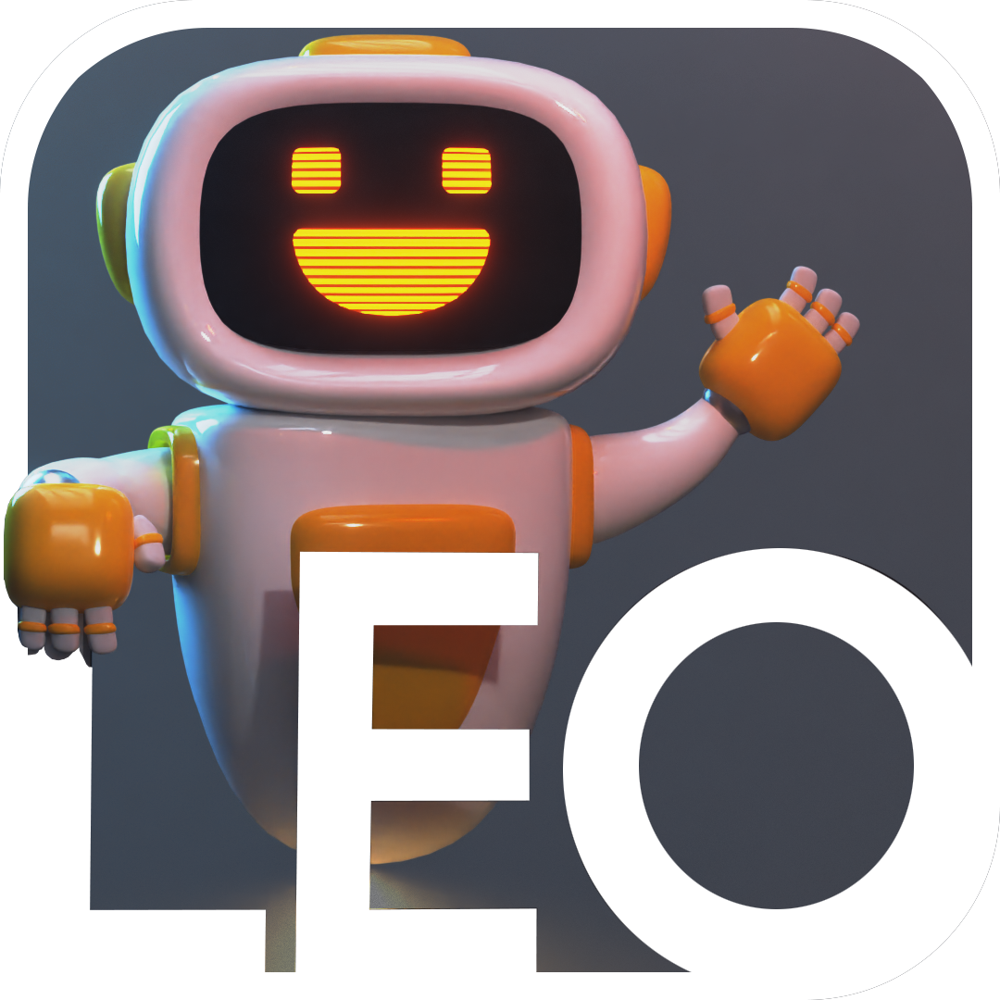

# LeoEngine

  

 
  </img>

  

Leo is a C++ based game engine that uses an App <-> Core approach. The Core contains all the backend code and engine logic as well as
all the external dependencies so that developers can focus on the game itself and don't have to worry about anything else. It also contains the entry point
for the program which runs the app. It then compiles to a dynamic library.
The App or the Sandbox is written in C++ and includes the Core functionality. Because there is no editor yet the game logic is to be written there.
